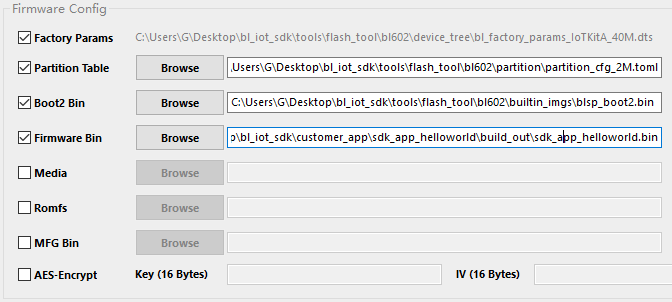

# Start guide 
* [中文版](./README.md)    

## Summarize
BL602/BL604 is a Wi-Fi+BLE chipset introduced by Bouffalo Lab, which is used for low power consumption and high performance application development.
The wireless subsystem includes 2.4G radio, Wi-Fi 802.11b/g/n and BLE 5.0 baseband /MAC design. The microcontroller subsystem includes a 32-bit RISC CPU with low power consumption, cache and memory. The power management unit controls the low power consumption mode. In addition, it also supports various security features.
The external interfaces include SDIO, SPI, UART, I2C, IR remote, PWM, ADC, DAC, PIR and GPIO.

## Get ready
* A BL602 development board
* USB data cable (A to Micro-B)
* A PC 

## Development process
The following demonstrates the development process under Linux environment, See [docs](docs) for other development environments

## Build a development environment
1. Prepare a Linux host, and win10 users can use the Liunx subsystem
2. Open the terminal, install make, and command `sudo apt-get install make`
3. To install git, command `sudo apt-get install git`.
4. Clone warehouse `git clone https://github.com/SmartArduino/Doiting_BL.git`
5. Modify the permissions and run the following two commands
   ```
   chmod -R 777 ./Doiting_BL/bl_iot_sdk/toolchain/
   find ./Doiting_BL/bl_iot_sdk/customer_app -name "genromap"|xargs chmod 777
   ```

## Compile
The following uses hello-world as an example
* Because the tool chain is placed in the SDK, it can be compiled directly without downloading the tool chain
1. Enter the routine directory and command `cd Doiting_BL/bl_IOT_SDK/customer_app/SDK_app_helloworld/`
2. Compile with sh script provided by the project, command `./genromap`.
3. Compilation completion prompt:
    ```
    Generating BIN File to /home/hogc/Doiting_BL/bl_iot_sdk/ customer_app/sdk_app_helloworld/build_out/sdk_app_helloworld.bin
    Building Finish. To flash build output.
    ```

## Firmware burning
1. Connect the development board to the computer, please ensure that the serial port driver is installed and win10 is automatically installed
2. Open the burning tool and store it in Doiting_BL\bl_iot_sdk\tools\flash_tool
3. Chip type selection: BL602/604
4. Select Interface as Uart, and select the corresponding serial port of development board
5. Select firmware
    1. Check the Partition Table, Boot2 Bin and Firmware Bin tabs
    2. Add a file for Partition Table, click Browse after Partition Table and select partition_CFG_2m.toml
    3. Click Browse after Boot2 Bin and select blsp_boot2.bin
    4. Click Browse behind Firmware Bin, find build_out under sdk_app_helloworld directory, and select SDK_app_helloworld.bin.
    
6. Make the developmENt board enter the burning mode, press and hold D8(GPIO8) key, press en key again, and then release D8 key
7. Click Create&Download, the progress bar will turn green, and Success will be displayed if success is displayed.

## Verify firmware
1. Connect the development board with serial port tool
    * Baud rate: 2000000 data bits: 8 check bits: None stop bits: 1
2. Open the serial port and reset the development board (click the EN key)
3. If the following is displayed, the operation is successful
    ```
    [helloworld]   start
    [helloworld]   helloworld
    [helloworld]   end
    ```

## Separation SDK and project
1. Open the Linux terminal, configure the profile file, and command ` vim ~/.profile.
2. Add environment variables and fill in the real path
    ```
    export BL60X_SDK_PATH="$HOME/Doiting_BL/bl_iot_sdk"
    ```

## Note
* Burning may be automatically upgraded, and the Partition file may be different. If the program runs abnormally, this Partition file can be replaced [partition_cfg_2M.toml](docs/_static/partition_cfg_2M.toml)
* After burning, the progress bar appears red. Please try again, or use the serial port tool to connect and enter the download mode correctly. The serial port will always print garbage

## Resources
* Development board purchase [taobao](https://item.taobao.com/item.htm?spm=a1z10.3-c-s.w4002-23087949821.11.58325ac1BMHbKT&id=627734275519) or [aliexpress](https://www.aliexpress.com/item/1005001452354979.html?spm=5261.ProductManageOnline.0.0.c5154edfE7V5mg)
* Technical exchange QQ group: 278888900
